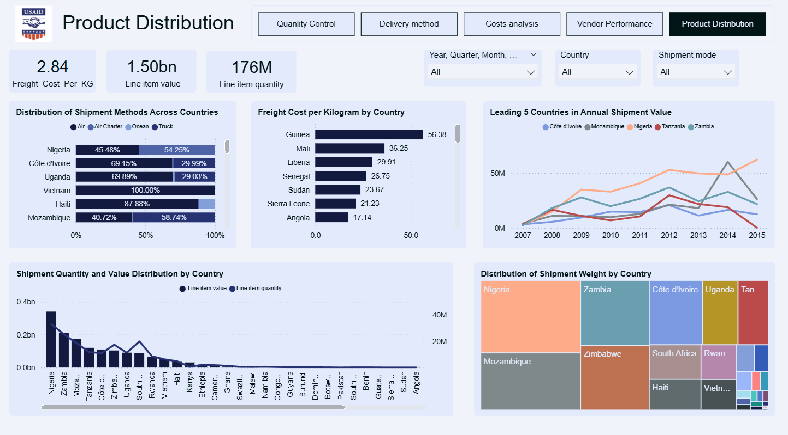
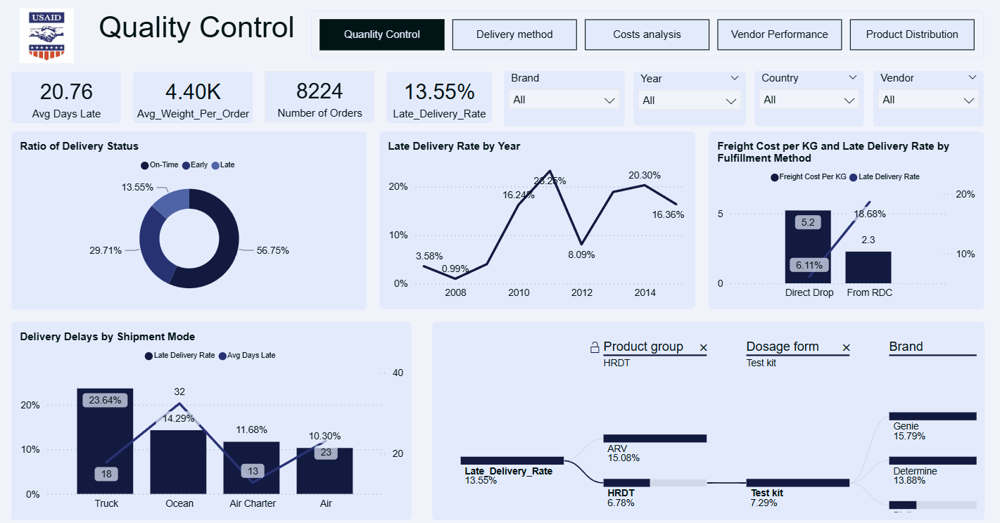
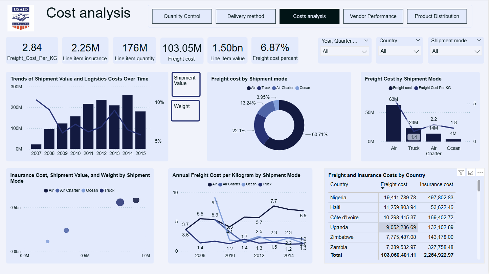
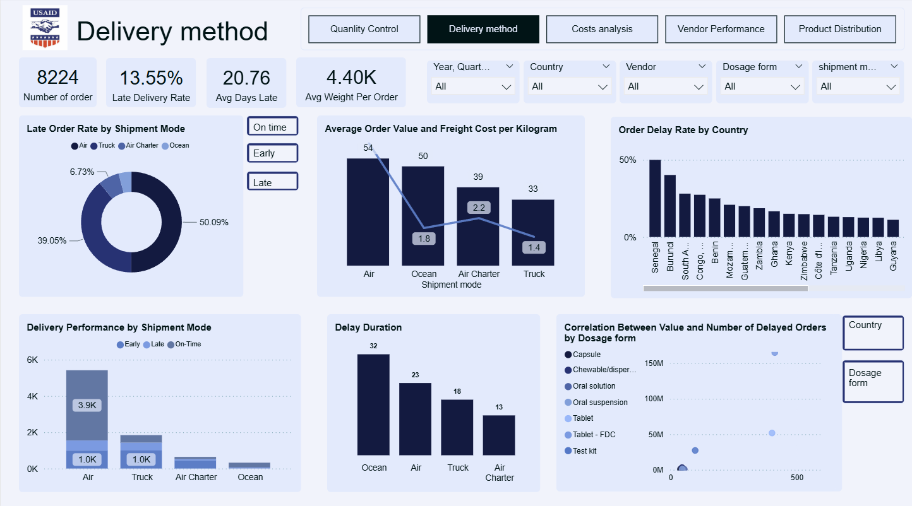
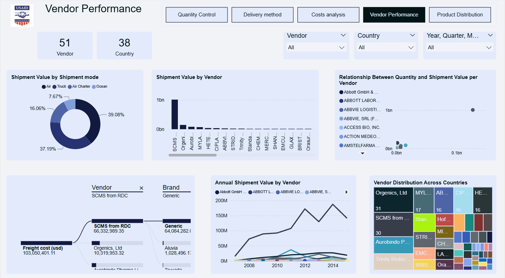

# 🌍 USAID Shipment Analysis

## 📌 Giới thiệu

Dự án **USAID Shipment Analysis** tập trung vào việc **phân tích hiệu quả và quản lý chuỗi cung ứng y tế toàn cầu của USAID**.  
Nguồn dữ liệu chính là **Supply Chain Shipment Pricing Data** do USAID cung cấp, bao gồm thông tin về vận chuyển và giá cả của các mặt hàng y tế trong giai đoạn **2007–2015**.

Bộ dữ liệu có:
- **10.324 dòng** và **33 cột** thông tin (sau xử lý còn **8.224 dòng, 30 cột**).
- Các nhóm thông tin chính: mã đơn hàng, quốc gia, nhà cung cấp, loại sản phẩm, số lượng, giá trị đơn hàng, chi phí vận chuyển, thời gian giao hàng, v.v.

---

## 🛠️ Quy trình xử lý dữ liệu

### 1. Tiền xử lý (Data Preprocessing)

Quá trình tiền xử lý dữ liệu bao gồm các bước quan trọng để đảm bảo chất lượng dữ liệu:

- **Chuẩn hóa dữ liệu**: Loại bỏ các giá trị không hợp lệ, chuẩn hóa định dạng
- **Xử lý dữ liệu thiếu**: Xử lý các giá trị null, điền thông tin thiếu hoặc loại bỏ các bản ghi không đầy đủ
- **Loại bỏ trùng lặp**: Xác định và loại bỏ các bản ghi trùng lặp trong dataset
- **Chuyển đổi định dạng**: Chuyển đổi định dạng ngày tháng, chuẩn hóa các biến phân loại (categorical variables)
- **Làm sạch dữ liệu**: Xử lý các ký tự đặc biệt, chuẩn hóa tên quốc gia, nhà cung cấp

Kết quả: Từ **10.324 dòng, 33 cột** ban đầu, sau xử lý còn **8.224 dòng, 30 cột** dữ liệu sạch và sẵn sàng cho phân tích.

### 2. Phân tích chính (Main Analysis)

Dự án thực hiện 5 phân tích chính với các dashboard và insight quan trọng:

#### 📦 Product Distribution
Phân tích phân bổ sản phẩm theo quốc gia, khối lượng, giá trị và các nhóm sản phẩm khác nhau.

**Insight chính:**
- Xác định các thị trường trọng điểm với khối lượng vận chuyển lớn
- Phân tích xu hướng phân bổ sản phẩm theo khu vực địa lý
- Đánh giá mức độ đa dạng sản phẩm tại từng quốc gia

#### ✅ Quality Control
Đo lường tỷ lệ giao hàng trễ, số ngày trễ trung bình, chất lượng vận chuyển theo phương thức.

**Insight chính:**
- Tỷ lệ giao hàng trễ trung bình của USAID: **13,55%**, cao hơn chuẩn ngành (5–10%)
- Phân tích các yếu tố ảnh hưởng đến chất lượng giao hàng
- Đánh giá hiệu quả các biện pháp kiểm soát chất lượng

#### 💰 Cost Analysis
Đánh giá chi phí logistics theo năm, theo phương thức vận chuyển và theo quốc gia.

**Insight chính:**
- Chi phí logistics chiếm **6,9%** tổng giá trị hàng hóa (khoảng **103 triệu USD**)
- Chi phí vận chuyển chênh lệch đáng kể giữa các quốc gia:
  - **Guinea** có chi phí cao nhất: **56,38 USD/kg**
  - **Mozambique** thấp nhất: **1,03 USD/kg**
- Phân tích xu hướng chi phí theo thời gian và phương thức vận chuyển

#### 🚚 Delivery Method
So sánh chất lượng giao hàng giữa các phương thức: Air, Ocean, Truck, Air Charter.

**Insight chính:**
- **Air Charter** giúp rút ngắn thời gian trễ (13 ngày trung bình) so với Ocean (32 ngày)
- Phân tích hiệu quả chi phí và thời gian của từng phương thức
- Đề xuất phương thức vận chuyển tối ưu cho từng loại hàng hóa

#### 🏢 Vendor Performance
Phân tích hiệu quả hoạt động của các nhà cung cấp về độ tin cậy, chi phí và chất lượng dịch vụ.

**Insight chính:**
- Xác định các nhà cung cấp có hiệu suất cao và cần cải thiện
- Phân tích mối quan hệ giữa chi phí và chất lượng dịch vụ
- Đánh giá độ tin cậy và tính nhất quán trong giao hàng

---

## 📊 Một số kết quả nổi bật

### Thị trường trọng điểm
- **Nigeria, Zambia, Mozambique** là những thị trường trọng điểm với khối lượng vận chuyển lớn nhất

### Phân tích chi phí
- Chi phí vận chuyển chênh lệch đáng kể giữa các quốc gia:
  - Guinea có chi phí cao nhất (**56,38 USD/kg**)
  - Mozambique thấp nhất (**1,03 USD/kg**)

### Chất lượng giao hàng
- Tỷ lệ giao hàng trễ trung bình của USAID: **13,55%**, cao hơn chuẩn ngành (5–10%)
- Phương thức vận chuyển **Air Charter** giúp rút ngắn thời gian trễ (13 ngày trung bình) so với Ocean (32 ngày)

### Tổng quan chi phí
- Chi phí logistics chiếm **6,9%** tổng giá trị hàng hóa (khoảng **103 triệu USD**)

---

## 🚀 Công nghệ sử dụng

- **Python** (pandas, numpy, matplotlib, seaborn) cho phân tích và xử lý dữ liệu
- **Jupyter Notebook** cho phân tích tương tác và trực quan hóa dữ liệu
- **Power BI** cho dashboard trực quan và báo cáo tương tác
- **Canva** cho thiết kế slide báo cáo chuyên nghiệp

---

## 📂 Tài liệu liên quan

- 📑 **Slide chi tiết báo cáo**: [Xem tại đây](https://www.canva.com/design/DAG0ipzdtWo/WVvXx5W4nCCuguqC9dBuqw/edit)
- 📘 **File phân tích đầy đủ**: `USAID Analysis.pdf` (lưu trữ cục bộ, không push lên GitHub do dung lượng lớn)
- 📊 **Dashboard trực quan (Power BI)**: [Xem trực tiếp](https://app.powerbi.com/view?r=eyJrIjoiMTQ5ZGRiMzYtYjIxZi00MjYzLWJhZDUtNjhjZDllOGRjODE5IiwidCI6ImFmMWYzNzUzLTM5MjUtNGU2Zi05NDliLTk3YzAwNzMyMDgwMyIsImMiOjEwfQ%3D%3D&fbclid=IwY2xjawNGHZ9leHRuA2FlbQIxMABicmlqETFqRlIwQWM2UmxnV3R6cTF0AR7IJ_K2dLnQ0hjQsn_59ftFyts0e2wIdDhB5AEI_MyrnexoWMHLzj9wg6I8uw_aem_GklOs_earwyzABcsigod5Q)

---

## ✨ Mục tiêu dự án

- **Đánh giá hiệu quả logistics** trong chuỗi cung ứng y tế của USAID
- **Xác định nguyên nhân** gây chậm trễ và đề xuất cải tiến
- **Đưa ra khuyến nghị** để tối ưu chi phí và nâng cao chất lượng giao hàng
- **Cung cấp insights** dựa trên dữ liệu để hỗ trợ ra quyết định chiến lược

---

✍️ *Dự án thực hiện như một case study phân tích dữ liệu, kết hợp Python và Power BI để mang lại cái nhìn trực quan và thực tiễn về hiệu quả chuỗi cung ứng y tế toàn cầu.*
